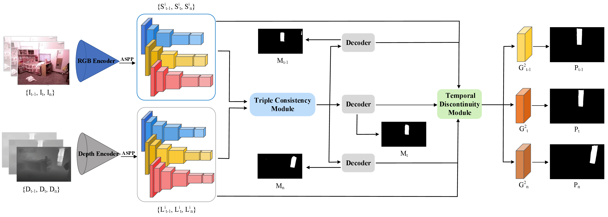

# RGB-D Video Mirror Detection (WACV 2025)

Mingchen Xu, Peter Herbert, Yukun Lai, Ze Ji, Jing Wu

School of Computer Science and Informatics, Cardiff University

School of Engineering, Cardiff University

<p align="center">
  
</p>

## Requirement

python==3.8.17

cuda==11.1

cudnn==8.1.0.77

torch==1.9.0+cu111

timm==0.9.6

transformers==4.30.2 

pytorch==1.8.2

torchvision==0.10.0+cu111

medpy==0.4.0

einops==0.6.1


## Usage Instructions

1. **Setup**

   Clone the repository and navigate to its directory:

   ```shell
   git clone https://github.com/UpChen/2025_DVMDNet.git
   cd 2025_DVMDNet
   ```
   
2. **Dataset Preparation**

   Download and unzip ([DVMD dataset](https://drive.google.com/drive/folders/1QwcB8Oxd1h5t_sa_wFoSNPUQlpSK1-af?usp=drive_link)).
   
3. **Training**
   
   To train the model, execute:
    
   ```shell
   python train.py
   ```
   
4. **Testing**

   Download the weight of a well-trained DVMDNet on DVMD dataset ([model weights](https://drive.google.com/drive/folders/1qNAAlUL6cQSXKa73rzCPLVba0ETmDz0g?usp=drive_link)).

   After training, update the checkpoint file path in the infer.py script. Then, test the trained model using:
   
   ```shell
   python infer.py
   ```
   
6. **Evaluating**

   After testing, update the results file path in the eval.py script. Then, evaluate the results using:
   
   ```shell
   python eval.py
   ```
   
## Citation

If you use this code or the associated paper in your work, please cite:
   
```
@InProceedings{Xu_2025_WACV,
    author    = {Xu, Mingchen and Herbert, Peter and Lai, Yu-Kun and Ji, Ze and Wu, Jing},
    title     = {RGB-D Video Mirror Detection},
    booktitle = {Proceedings of the Winter Conference on Applications of Computer Vision (WACV)},
    month     = {February},
    year      = {2025},
    pages     = {9622-9631}
}
```

### Contact
If you have any questions, please feel free to contact me via `xum35@cardiff.ac.uk`.
